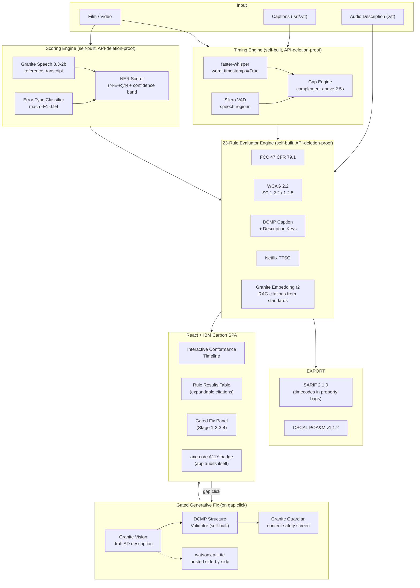

# ACCESSGATE

**A local, explainable conformance pre-check engine for film accessibility: click a failing audio-description gap, and Granite Vision drafts a fix, the DCMP validator re-checks it, Granite Guardian screens it, and the row flips green live on an interactive timeline.**

[](https://github.com/StephenSook/accessgate/actions/workflows/test.yml)
[](https://accessgate-web.vercel.app)
[](LICENSE)
[](https://www.python.org/downloads/)
[](https://lablab.ai)
[](tests/)

Built for the **IBM AI Builders Challenge July 2026**, **Reimagine Creative Industries with AI** track.

> **"Only 16 of 90 Sundance 2026 films were watchable if you are blind. We fix the rest before they ship."**

The locked claim: **conformance pre-check: automatable checks plus human-judgment flags.** This is not a certifier.

---

## Live Demo

| Surface | URL |
|---|---|
| Demo video (2 min) | https://youtu.be/ViZv4So01vw |
| Web app | https://accessgate-web.vercel.app |
| Mobile app (Android) | [APK direct download](https://expo.dev/artifacts/eas/H9la7B8YzJAZaxVoGGWxbvSNrmAO5jhDY60LTc_RS9s.apk), install on any Android phone |
| Mobile app (iOS) | [TestFlight](https://testflight.apple.com/join/vAGsWSVz) (public link, install on any iPhone; source in [`mobile/`](mobile/)) |
| REST API | https://accessgate-api.onrender.com |
| Health check | https://accessgate-api.onrender.com/health |
| Pre-computed demo report | https://accessgate-api.onrender.com/demo |
| GitHub | https://github.com/StephenSook/accessgate |

**Two surfaces, one live engine.** The web app and a native mobile app (Expo/React Native, [`mobile/`](mobile/)) are both real clients of the same backend: load the demo report and Granite executive summary, review the flagged rules with their standard citations, and run the gated generative fix on a silent gap. Mobile also checks a caption file picked on-device. See [mobile/README.md](mobile/README.md) to run it.

Open the web app and click **LOAD DEMO** to see the full conformance timeline, rule results table, NER score, and gap markers, no file upload needed. The demo runs on a Night of the Living Dead segment (United States public domain) whose caption and audio-description sidecars carry realistic conformance defects. Uploading your own caption file on the live site runs the same 23-rule engine on the hosted backend.

<table><tr>
<td align="center"><br><b>Android APK</b><br><sub>scan or <a href="https://expo.dev/artifacts/eas/H9la7B8YzJAZaxVoGGWxbvSNrmAO5jhDY60LTc_RS9s.apk">direct download</a></sub></td>
<td align="center"><br><b>iOS TestFlight</b><br><sub>scan or <a href="https://testflight.apple.com/join/vAGsWSVz">join link</a></sub></td>
</tr></table>

To run the full live engine with Ollama models locally, see [Build and Run](#build-and-run).

---

## The Problem

At Sundance 2026, only 16 of 90 feature films offered audio description, down from 26 in 2024. Festivals, distributors, and streaming platforms reject non-compliant caption and audio-description files using automated QC pipelines. Manual QC costs $9-$14/min for audio description. No open-source tool checks both caption and audio-description conformance against WCAG 2.2, FCC 47 CFR 79.1(j)(2), DCMP, and Netflix standards simultaneously. ADA Title II compliance deadlines arrive April 2027 and April 2028.

---

## What It Does

AccessGate ingests a film plus its caption (.srt/.vtt) and audio-description (.vtt) sidecar files, scores them against **23 coded rules** across four standards families, and returns a per-rule pass/fail report where every flag cites the exact standard text it came from, retrieved at runtime from a Granite Embedding index, never hardcoded.

**Every flag is verifiable, not guessed.** Run it on a real broadcast-defective caption file and each finding traces to the exact FCC, WCAG, DCMP, or Netflix text a human reviewer can open and check, not a black-box score. The same report speaks to two audiences: the rule-by-rule citations for compliance engineers, and a plain-English watsonx executive summary for producers and other non-technical stakeholders.

Click a failing audio-description gap on the conformance timeline and the gated fix loop runs: Granite Vision drafts a description sized to fit the silent window, the DCMP structure validator re-checks it, Granite Guardian screens it for content safety, and the row flips green live.

**Delete every hosted AI API. The engine still runs and still produces a report.** That property, plus a deep and genuinely load-bearing IBM stack built through IBM Bob, is the differentiator.

To our knowledge, AccessGate is the first tool that is all of these at once: open, explainable, covering both captions and audio description, citing the exact standard clause behind every flag, and drafting a gated generative fix. Commercial timed-text QC tools exist, but none are open, cover both surfaces, cite the standard text, and fix the gap. The novelty is the intersection, not any single feature.

---

## AccessGate in One Loop

> A film's caption file has a 44-character line, a 1.2-second cue, a 240-wpm burst, a sound effect without a source bracket, and a 2.1-second sync drift. Its audio-description file has a past-tense line, a jargon term, and an AD line overlapping dialogue. The NER caption score lands at 94.1%, below 98%, but ASR carries measured racial disparity (Koenecke et al., PNAS 2020: WER 0.35 for Black speakers vs 0.19 for white), so the band is flagged for human review, never auto-failed. Every flag cites the exact standard section that governs it. Click the failing AD gap at 67.2s. Granite Vision drafts a present-tense, active-voice, third-person description that fits the 6.6-second window. The DCMP validator passes it. Guardian clears it. The row flips green.

---

## Architecture



---

## IBM Stack (what is actually wired)

Every row below is wired in the shipped code, not aspirational. The wiring column states exactly how, because honest labeling is the point: a judge can grep any claim. See the live `/judges` endpoint for the same breakdown.

| IBM Tool | Role | Wiring |
|---|---|---|
| **IBM Bob** | Primary development tool: authored the conformance engine, the test suite, and the frontend; parallel subagents; custom mode; conformance Skill; Plan specs; two /review audits (SARIF + OSCAL); self-referential MCP loop. Deployment and later Granite Speech wiring / UI refinements were finished with other tooling after Bob credits ran out. | Primary development tool |
| **Granite Speech 3.3-2b** | High-accuracy reference transcript feeding the NER scorer | Wired, local `transformers` (`src/granite_speech.py`, opt-in `ACCESSGATE_GRANITE_SPEECH=1`; faster-whisper is the default reference because Granite Speech is ~20x realtime on CPU) |
| **Granite Vision 3.2 2b** | Drafts the AD fix on a failing gap | Wired, local Ollama (`src/generative_fix.py`) |
| **Granite Guardian 3 2b** | Screens generated AD for content safety before the row flips green | Wired, local Ollama (`src/generative_fix.py`) |
| **Granite Embedding r2** | Embeds the standards corpus so citations are retrieved at runtime, never hardcoded | Wired, `sentence-transformers` (`src/rag.py`; deterministic TF-IDF fallback if unavailable) |
| **watsonx.ai (granite-3-8b-instruct)** | Hosted AD-line generation and a plain-English report summary (`src/report_summary.py`), side by side with the local Granite path | Wired, hosted (`src/watsonx_showcase.py`) |
| **watsonx-hosted vision (Llama 3.2 11B)** | Drafts the gap fix live on the hosted demo where there is no Ollama (`/demo-fix`); Granite Vision is the local model | Wired, `src/watsonx_vision.py` |
| **Docling** | Parses the WCAG, FCC, DCMP and Netflix source pages into the markdown corpus the RAG cites | Wired, `scripts/parse_standards.py` → `standards/parsed/` (6 docs) |
| **AI FactSheet model card** | Governance doc for the trained classifier: training data, evaluation, and ASR-disparity bias handling | `data/training/model_card.md` |

---

## Four Self-Built Load-Bearing Artifacts

Each passes the **API-deletion test**: remove every hosted AI API and each still runs.

1. **Conformance rule engine**: NER scorer (`(N-E-R)/N`, Romero-Fresco/Ofcom broadcast model), 98% threshold, confidence bands, never auto-fails on ASR alone per Koenecke et al. PNAS 2020
2. **Dialogue-gap detection and timing engine**: Silero VAD + silence detection, gap complement above 2.5s minimum, merged across sub-300ms blips
3. **Audio-description structure validator**: DCMP rules: word-count-fits-gap, no-overlap-with-dialogue, present-tense, active-voice, third-person, objectivity flags
4. **Caption error-type classifier**: supervised logistic regression on a synthetic weak-labeled set, distinguishes recognition errors (ASR mishears) from edition errors (paraphrase/omission); **macro-F1: 0.94**

---

## Evaluation (measured, not asserted)

| Metric | Value | Source |
|---|---|---|
| Classifier macro-F1 | **0.94** | synthetic held-out set, 3-class |
| Rule engine: violations detected | **10 / 10** | `data/demo/notld_broken.srt` + `notld_broken_ad.vtt` degradation recipe |
| SARIF schema valid | **pass** | `@microsoft/sarif-multitool validate` in CI |
| axe-core A11Y score | **100%** | App audits its own UI on every load |
| Tests passing | **195** | `pytest` on Python 3.11 and 3.12 |

---

## How IBM Bob Was Used

IBM Bob was the primary development tool. It authored the conformance engine (~4,900 lines across `src/`, including the 23 rule evaluators, the NER scorer, the VAD gap engine, and the SARIF/OSCAL exporters), the 195-test suite (~2,000 lines in `tests/`), and the React frontend (~2,400 lines). Deployment, the Granite Speech wiring, and the UI and honesty refinements were finished with other tooling after Bob credits ran out, so the honest claim is Bob as primary, not exclusive.

| Evidence | Location |
|---|---|
| Custom mode (`accessibility-compliance-engineer`) | `.bob/custom_modes.yaml` |
| Conformance rule-authoring skill | `.bob/skills/conformance/SKILL.md` |
| /review audit 1 (SARIF) | `security/review-audit-1.sarif` |
| /review audit 2 (OSCAL POA&M) | `security/review-audit-2.oscal.json` |
| Self-referential MCP config | `.bob/mcp.json` |
| Bobalytics usage screenshot | `bob_sessions/bobalytics-usage.png` |

---

## Build and Run

```bash
# 1. Clone and install
git clone https://github.com/StephenSook/accessgate.git
cd accessgate
pip install -r requirements.txt

# 2. Pull Ollama models (requires Ollama running locally)
ollama pull granite3.2-vision:2b
ollama pull granite3-guardian:2b
ollama pull granite3.2:8b

# 3. Copy env template
cp .env.example .env  # fill in WATSONX_API_KEY + WATSONX_PROJECT if you have them

# 4. Run the conformance engine (CLI): <film/audio> <caption> [audio-description]
# Writes JSON + SARIF + OSCAL to outputs/. Exits non-zero when conformance fails.
# The 3 dialogue-free gaps come from VAD on the audio track.
python -m src.engine data/demo/notld_segment_16k.wav data/demo/notld_broken.srt data/demo/notld_broken_ad.vtt

# 5. Run tests
pytest

# 6. Start the API server
uvicorn src.app:app --reload --port 8000

# 7. Start the frontend (separate terminal)
cd frontend && npm install && npm run dev
# Open http://localhost:5173

# 8. Lint SARIF export (validates against the vendored SARIF 2.1.0 schema)
python scripts/validate_sarif.py security/review-audit-1.sarif
```

---

## Repository Structure

```
accessgate/
├── src/
│   ├── engine.py              # Main CLI entry point
│   ├── models.py              # Pydantic data models
│   ├── registry.py            # Rule registry loader
│   ├── caption_parser.py      # SRT/VTT parser
│   ├── gap_engine.py          # Silero VAD gap detector
│   ├── ner_scorer.py          # NER-style caption scorer
│   ├── classifier.py          # Error-type classifier (macro-F1 0.94)
│   ├── rag.py                 # Granite Embedding RAG layer
│   ├── generative_fix.py      # Granite Vision -> DCMP -> Guardian fix loop
│   ├── app.py                 # FastAPI REST server + /demo endpoint
│   ├── live_monitor.py        # Sliding-window live caption monitor
│   ├── watsonx_showcase.py    # watsonx.ai Lite hosted showcase call
│   ├── evaluators/            # fcc.py, wcag.py, dcmp_caption.py, dcmp_desc.py, netflix.py
│   ├── exporters/             # sarif.py (2.1.0), oscal.py (POA&M v1.1.2)
│   └── mcp_server/            # FastMCP server (self-referential IBM Bob loop)
├── rules/rules_registry.yaml  # 23 rules across FCC / WCAG / DCMP / Netflix
├── standards/                 # Authoritative standards corpus + Granite Embedding index
├── data/
│   ├── demo/                  # notld_broken.srt, notld_broken_ad.vtt, demo_report.json
│   └── training/
│       ├── model_card.md      # IBM AI FactSheet for the classifier
│       └── label_schema.md    # Annotation schema
├── frontend/                  # Vite + React + IBM Carbon SPA
├── mobile/                    # Expo / React Native (iOS + Android) client
├── security/                  # SARIF + OSCAL /review audit outputs
├── bob_sessions/              # IBM Bob usage screenshot (Bobalytics)
├── tests/                     # 195 passing tests
├── render.yaml                # Render deployment config (FastAPI backend)
├── AGENTS.md                  # Project policy spine (read every session)
└── .bob/                      # Custom mode, conformance skill, MCP config
```

---

## Selected Challenge Theme

**Reimagine Creative Industries with AI**: AccessGate reimagines the post-production accessibility step that determines whether blind and Deaf audiences can experience a film at all. It removes the manual QC bottleneck between a finished film and its full audience.

The same rule-engine-plus-gated-fix architecture generalizes to music rights conformance and dubbing QA.

**Who deploys it.** A studio, streamer, festival, or post-production house runs AccessGate as the caption-and-audio-description QC gate between a finished film and its release, and the live [`/judges`](https://accessgate-api.onrender.com/judges) page doubles as that operator's transparency console: every claim traces to a live endpoint. It is a product a QC team could drop into their pipeline on Monday, not a concept.

---

## Real-World Impact

- ADA Title II compliance deadlines: April 26, 2027 (population 50,000+) and April 26, 2028 (smaller entities)
- India MIB mandated audio description and closed captions for theatrical films (O.M. 15.03.2024) and OTT platforms (06.02.2026)
- Netflix auto-QC rejects non-compliant timed-text files before human review
- Manual AD QC costs $9-$14/min, AccessGate reduces the pre-check step to seconds
- The accessibility tool passes its own accessibility audit (axe-core, A11Y 100%)

---

## Demo Assets

- **Night of the Living Dead (1968)**: US public domain (published without valid copyright notice). Source: archive.org/details/night-of-the-living-dead_1968
- **Big Buck Bunny**: CC BY 3.0. Attribution: (c) copyright 2008, Blender Foundation / www.bigbuckbunny.org

See [NOTICE](NOTICE) for full third-party attribution.

---

## SkillsBuild

Every team member has completed an IBM SkillsBuild learning activity. The completion certificate is submitted on the BeMyApp project page.

---

## License

MIT. See [LICENSE](LICENSE). See [NOTICE](NOTICE) for third-party media and training-data attribution.
